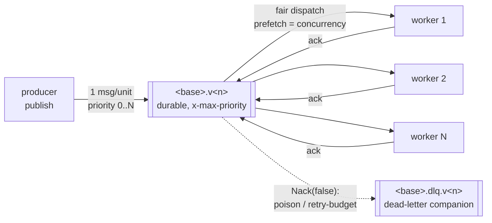
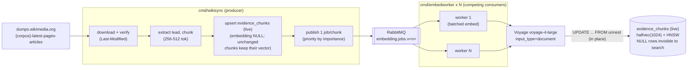
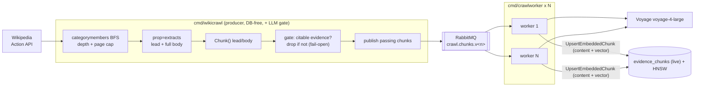

# Ingestion Pipeline

How the fact-checker's evidence corpora are built, embedded, and kept consistent in
Postgres + pgvector, and the resilience semantics that let an operator turn the ingestion hosts
off between runs without losing or corrupting work.

> Ground truth is always the code, never this page: the connector registry
> (`stack/backend/internal/connector/registry.go`, mirrored in `sources.json`), the migrations
> (`stack/backend/migrations/*.up.sql`), the sqlc queries (`stack/backend/queries/*.sql`), the
> config loaders (`stack/backend/internal/config`), and the commands under `stack/backend/cmd/`. If
> you change the pipeline, update this file in the same change.

> Scope: the **evidence corpora** an ingestion run fills - the generic `evidence_chunks` store, the
> curated `political_claims` claim corpus, and the `voting_records` store. They are **evidence-only**:
> they enrich matched claims but do not decide whether a live statement is checkable - that is the
> `claims` table. See `.claude/skills/data-map` for the full data dictionary.

---

## 1. One fleet, three evidence stores

Every ingestion source is one row in the **connector registry**
(`internal/connector/registry.go`): a producer that fills a broker queue and a worker that drains it
into a store. Adding a source is one registry entry plus its producer package and compose service;
no central wiring file is edited. The full per-source inventory - access method, cadence, licence,
attribution - is [`docs/fact-check-sources.md`](fact-check-sources.md); this page is the pipeline
mechanics common to all of them.

The workers write into three stores, one per evidence shape:

| Store | Written by | Holds |
|-------|-----------|-------|
| `evidence_chunks` | `embedworker` (`embedding.jobs`), `crawlworker` (`crawl.chunks`), `evidenceworker` (`evidence.chunks`) | Embedded text passages: Wikipedia (dump + category crawl), statistics (INSEE/Eurostat/SDMX/ODS), parliament text, and institutional sources. One `source` discriminator per corpus; searched by cosine + lexical hybrid. |
| `political_claims` | `factcheckworker` (`factcheck.claims`) | Curated already-checked claims (claim text + categorical verdict + review URL + outlet + date), embedded for the fast-path borrow. |
| `voting_records` | `scrutinsworker` (`scrutins.votes`) | Roll-call votes (Assemblée nationale + Sénat); an exact relational lookup, not vector search. |

`evidence_chunks` is the single source-extensible evidence store (migration `0013`, generalizing the
former Wikipedia-only `wiki_chunks`): a new source is rows under a new `source` value, never a
migration and never a new column. Its identity is the generic natural key
`(source, external_id, chunk_index)`.

---

## 2. The queues and their workers

Each pipeline is one durable, priority-ordered RabbitMQ work queue with a competing-consumer worker
fleet. Every worker replica is a competing consumer on the same queue, so throughput scales with the
replica count for the same spend.

| Queue | Producers | Worker | Sink |
|-------|-----------|--------|------|
| `embedding.jobs` | `wikisync` (dump), `statsingest`, `sdmxcrawl`, `odsingest` | `embedworker` | `evidence_chunks` |
| `crawl.chunks` | `wikicrawl` (category crawl) | `crawlworker` | `evidence_chunks` |
| `evidence.chunks` | `parliamentcrawl` (textual datasets), `viepubliquecrawl`, `hatvpcrawl`, `legifrancecrawl` | `evidenceworker` | `evidence_chunks` |
| `factcheck.claims` | `factcheckcrawl`, `datacommonscrawl`, `claimreviewcrawl`, `claimskgseed` | `factcheckworker` | `political_claims` |
| `scrutins.votes` | `scrutinscrawl`, `parliamentcrawl` (Sénat scrutins) | `scrutinsworker` | `voting_records` |



- **Versioned names.** Each queue is `<base>.v<version>`; `RABBITMQ_QUEUE_VERSIONS` is a
  comma-separated, oldest-first list (default `2`). The newest version is active - the producer
  publishes to it and stamps `x-queue-version` on every message; a worker drops a message stamped
  with a version it does not know. To roll, append a version; workers on the old version drain it,
  then it leaves the list. These are versions of one logical queue, not per-worker queues.
- **Priority.** The queue is declared with `x-max-priority` (`RABBITMQ_MAX_PRIORITY`, default 10).
  Higher-priority units (e.g. lead chunks over body chunks) are delivered first.
- **Prefetch / QoS.** `RABBITMQ_PREFETCH` (default 1; the embed worker sizes it to in-flight
  batches) caps the unacked messages the broker pushes to one consumer, so no single slow worker
  hoards work.

---

## 3. The two Wikipedia paths into `evidence_chunks`

Wikipedia fills `evidence_chunks` (`source = WIKI_CORPUS` for the dump, `CRAWL_CORPUS` for the
crawl) two ways. They share the broker, the embedding model, the schema, and the consistency
guarantees, and never touch each other's checkpoints or staging.

| | **Dump path** | **Category-crawl path** |
|---|---|---|
| Source | Multi-GB Wikimedia dump over HTTP | MediaWiki **Action API**, category-driven, no dump |
| Producer | `cmd/wikisync` | `cmd/wikicrawl` (DB-free) |
| Filter | none (all lead paragraphs) | **fact-checkability LLM gate** in the producer |
| Worker | `cmd/embedworker` | `cmd/crawlworker` |
| Queue | `embedding.jobs.v<n>` | `crawl.chunks.v<n>` |
| Lifecycle | bulk-into-live (or `-atomic` staging swap) | additive upsert into live |
| Use it for | a whole language's worth of leads | a focused, pre-filtered, evidence-only slice |

### Dump path (bulk-into-live)

Default: chunks land in `evidence_chunks` immediately with `embedding` NULL and become searchable
the moment the fleet writes each vector, so the corpus grows monotonically and is queryable
mid-ingest - no swap.



The opt-in `-atomic` mode (used by `make reingest`) builds a staging table, the fleet drains it, and
one transaction builds the HNSW index and swaps staging over live - readers see the old corpus until
the swap commits. Use it for a breaking re-chunk where serving a mix of old and new chunks is
unacceptable. `-mode=delta` refetches only pages changed since the checkpoint; `-mode=reset` clears
the corpus + checkpoint.

### Category-crawl path (additive, gated)

`cmd/wikicrawl` traverses categories over the Action API, chunks lead + body, and runs a per-chunk
**fact-checkability gate** (`internal/evidencegate`) before publishing, so only citable evidence
reaches the broker and all downstream embedding spend is bounded to it. The producer is DB-free and
publishes one self-contained `CrawlJob` per passing chunk; `cmd/crawlworker` embeds each and upserts
content + vector into live `evidence_chunks` in one statement.



- **The gate** is a forced-tool, temperature-0 judgment ("is this passage verifiable, citable
  factual evidence?") on the cheapest fast model via `internal/llm`. It runs **in the producer**, so
  a rejected chunk never reaches the broker. It is distinct from `internal/checkworthy`, which judges
  a short spoken statement on the live path.
- **Fail-open.** On any gate error the chunk is published anyway and the error logged, so a flaky
  model can never silently empty the corpus. `CRAWL_CHECKWORTHY=false` publishes every chunk.
- **Baked at crawl time.** Re-tuning the prompt/threshold means re-crawling. Dropped-vs-published is
  counted and logged per batch and at the end of the run.

---

## 4. The embed-worker per-batch lifecycle (token-aware batching)

`cmd/embedworker` (the `embedding.jobs` fleet) buffers deliveries up to `EMBED_WORKER_BATCH_SIZE`
(128) or `EMBED_WORKER_BATCH_WAIT` (200ms), then:

1. Drop any message that can never succeed (unknown queue version, malformed) - acked, so one poison
   message never sinks the batch.
2. **Token-aware split.** Before the provider call the batch is packed to a token budget:
   `EMBED_WORKER_MAX_BATCH_TOKENS` (default 96000 = 80% of Voyage's 120000 ceiling). An over-budget
   batch is split before the call; an oversize size-class splits recursively rather than thrashing
   per-chunk.
3. `EmbedDocuments([...])` embeds each sub-batch in one Voyage call.
4. Write in one `UPDATE evidence_chunks ... FROM unnest(...)` - text-form `halfvec`, matching on
   **content** as well as identity so a vector is never attached to text it was not computed from.
5. **Ack** the batch.
6. On batch embed failure, fall back to per-chunk embed; on write failure, re-enqueue each job at
   `attempt+1`. After `EMBED_WORKER_MAX_ATTEMPTS` (5) a job is dead-lettered (see section 5). Shutdown
   mid-batch Nacks with requeue (attempt not incremented).
7. An `UPDATE` matching no row (chunk gone, content changed, staging swapped) drops the job as
   obsolete.

Below the batch layer the embed client retries Voyage up to 6x on 429/timeout, honoring
`Retry-After`, otherwise 1s-60s exponential backoff + jitter; `EMBED_WORKER_RPM` is an optional
per-replica hard cap. The `crawl.chunks`, `evidence.chunks`, `factcheck.claims`, and `scrutins.votes`
workers mirror these ack/retry/requeue semantics per message.

---

## 5. Resilience semantics

The operator turns the ingestion hosts off between runs to save cost. This is safe at any instant:
every message is either already committed to its sink or returns to the queue for reprocessing, so
no work is lost and no row is corrupted. The mechanisms:

### Self-healing reconnect

The transport (`internal/queue`) is self-healing. A broker restart, a network blip, or the weekly
Amazon MQ maintenance reboot closes the connection; the client **redials with exponential backoff and
jitter, re-declares its topology, and re-establishes publishers and consumers transparently**, so a
`Publish` blocks across the outage and a `Consume` stream survives it without a call-site change. The
first redial waits `RABBITMQ_RECONNECT_MIN_BACKOFF` (250ms), each subsequent one doubles up to
`RABBITMQ_RECONNECT_MAX_BACKOFF` (30s), and every wait is jittered down to half its ceiling so a
fleet reconnecting after the same restart does not thunder in lockstep. `Close` ends the loop with
`ErrClosed` so a caller stops rather than wait for a reconnect that will never come.

### Dead-letter queues and replay

Nothing is dropped silently. A message a consumer rejects - a poison message (malformed, unknown
version, bad provider shape) or one past its retry budget - is `Nack(false)`ed and **dead-lettered**
to a companion queue rather than acked away. Each queue is declared with a dead-letter exchange
pointing at `<base>.dlq.v<n>` (e.g. `embedding.jobs.v1` yields `embedding.jobs.dlq.v1`). DLQ routing
is on by default (`RABBITMQ_DLQ_ENABLED=true`) and must be set identically on producers and consumers
or their queue declarations conflict.

**Replay procedure.** DLQs are for inspection and replay, not discard:

1. See the depth: `make pipeline-health` prints per-queue **and per-DLQ** backlog; the RabbitMQ
   management UI (local: <http://localhost:15672>, `app`/`dev`) shows individual parked messages.
2. Inspect a parked message's body and headers to find the defect (bad payload, a fixed bug, an
   outage that has since cleared).
3. Once fixed, move the messages back onto the live queue - via the management UI's "Move messages"
   (shovel) action, or the `rabbitmqadmin` CLI - where the fleet drains them normally. Because every
   worker write is an idempotent upsert, a replayed message that partly succeeded before is harmless.

A parked message is worth attention: the `dlq-depth` CloudWatch alarm (below) pages on any nonzero
DLQ.

### Producer checkpoints and error budgets

Producers are re-runnable without duplicating rows (every job key is a stable source id, never a
UUID/timestamp) and resume from a checkpoint after an interrupted run:

| Producer | Checkpoint / marker | Resume behaviour |
|----------|---------------------|------------------|
| `wikicrawl` | `CRAWL_CHECKPOINT_PATH` (default `/state/crawl-checkpoint.json`) | Records resolved pages; a killed crawl resumes without re-crawling them. A per-shard suffix isolates parallel shards. |
| `wikisync` | `evidence_sync_state` row (per `source`) | Delta resumes from `last_change_ts`; a mid-window bulk failure resumes from the last confirmed batch via the NULL-embedding filter. |
| `factcheckcrawl` | `FACTCHECK_CHECKPOINT_PATH` (a `/state` volume) | Each query/publisher stream is a checkpoint unit; a killed run resumes at the next undrained stream and clears on full success. |
| `scrutinscrawl` | `SCRUTINS_MARKER_PATH` (default `/state/scrutins-marker.json`) | Persisted ETag/Last-Modified makes the dump download a conditional GET; an unchanged archive returns 304 and does no work. |
| `parliamentcrawl` | per-dataset manifest (per-source state volume) + conditional GET | Diffs the dump against a manifest that fingerprints each record, so a daily run republishes only new or changed records. |
| `viepubliquecrawl` / `hatvpcrawl` / `legifrancecrawl` | conditional-GET marker + per-identifier manifest diff | Skip an unchanged feed; republish only records whose fingerprint moved. |

`wikicrawl` also carries an **error budget** (`CRAWL_ERROR_BUDGET`, default 50): a run may skip that
many pages (an extract failure or a fail-closed gate error) before it aborts, so a partial run is
visible rather than silently truncated or crashing on the first transient error.

### Drain-to-idle and consumer host self-stop

A worker normally runs until stopped, so an operator must remember to stop the consumer host once a
queue empties. `WORKER_IDLE_TIMEOUT` closes that loop: a worker whose queue yields no delivery for
that long **exits cleanly**, reporting what it drained through the standard Slack consumer-stop note.
It is **off (0/empty) by default, including locally**, so a fleet meant to stay up is unaffected;
capped at 24h.

The consumer command's `--stop-when-idle` (`scripts/ingest-host.sh`) hands the worker containers a
drain-to-idle window (`WORKER_IDLE_TIMEOUT`, default `300s` on the host), waits over the existing SSM
mechanics until every worker container has idle-exited, then stops the host - so cost is capped with
no operator action. The containers run `restart: on-failure`, so a clean idle-exit stays exited while
a crash still restarts. If the drain does not finish within `INGEST_DRAIN_TIMEOUT` (default `3600`s /
1h) the host is left running for inspection and the command exits non-zero.

### Graceful stop boundary

Every producer and worker traps SIGTERM (`signal.NotifyContext`), stops taking new deliveries, nacks
in-flight ones **with requeue** without incrementing the attempt count, and exits within a bounded
grace period. The OS-level stop timeout before SIGKILL is `stop_grace_period: 120s`, set on the
workers in **both** `docker-compose.yml` and the cloud override `docker-compose.ingest.yml`, so a
`docker compose down` or host stop gives in-flight embed/DB calls 120s to finish or requeue. An
at-least-once redelivery can re-embed the interrupted few messages (a bounded, paid re-embed), which
the idempotent sinks make correct and never duplicated.

### The stop/restart guarantee, mapped to code and tests

| # | Property | Guaranteeing code | Pinned by test |
|---|----------|-------------------|----------------|
| 1 | Messages are published **persistent** and queues are **durable** | `persistentPublishing` + `declareQueue(durable=true)` (`internal/queue/queue.go`) | `queue.TestPersistentPublishingIsPersistentAndVersioned`, `TestDeclareQueueDeclaresDurablePriorityQueue` |
| 2 | A consumer **acks only after its DB write commits** | Each worker acks only on `ActionAck` after the sink write returns nil; failures return `ActionRepublish`/`ActionRequeue` (`Process`/`handle`, every job package) | embedjob/crawljob/factcheckjob/scrutinsjob/evidencejob `TestRunAcks...` + `TestProcess...Republishes` |
| 3 | On SIGTERM the worker **nacks in-flight deliveries with requeue** and exits within the grace period | `signal.NotifyContext(SIGINT, SIGTERM)` cancels the context; an interrupted `Process` returns `ActionRequeue` then `Nack(requeue=true)`; `client.Close()` requeues anything unacked | `Test...NacksRequeueOnShutdown` per job package; `queue.TestClientCloseEndsConsumerWithoutCancel` |
| 4 | Writes are **idempotent upserts** | `UpsertEmbeddedChunk` / content-guarded `SetLiveChunkEmbeddings`; `UpsertPoliticalClaim`; `UpsertVotingRecord` - all `ON CONFLICT ... DO UPDATE` | store `TestUpsert...IsIdempotent`; worker `TestProcessRedeliveryIsIdempotent` |
| 5 | Producers are **re-runnable** without duplicating rows | Every job key is a stable source id (`(source, external_id, chunk_index)`, ClaimReview URL, scrutin uid), never a UUID/timestamp | wiki/stats/factcheck/scrutins/parliament producer re-run tests; real-RDS `make insee-idempotency-check` |
| 6 | A rejected message is **parked, not discarded** | `Nack(false)` dead-letters to `<base>.dlq.v<n>` via the dead-letter exchange (`DisableDLQ=false`) | `internal/queue` DLQ declaration tests and the DLQ-parked counts each worker reports on stop |

### The alarm surface (cloud)

The observability module (`stack/terraform/modules/observability`) fans these alerts into the
`*-alerts` SNS topic. The queue and run alarms key on the metrics the `mqmetrics` lambda and the
producers emit; they are enabled per env by wiring the queue/source lists (empty disables them).

| Alarm | Fires when | Missing-data policy |
|-------|-----------|---------------------|
| `queue-<base>-backlog-no-consumers` | A queue holds a backlog while no consumer is attached (`IF(consumers < 1, backlog, 0)`) - workers down while producers keep filling | `notBreaching` (a data gap is not an incident) |
| `dlq-<base>-depth` | Any message is parked in `<base>.dlq` (threshold 0, low evaluation period) | `notBreaching` (an absent/empty DLQ is healthy) |
| `source-<name>-no-run-24h` | A source emits no `RunSuccess` datapoint summing to at least 1 over the look-back window (default 24h) - a scheduled crawl silently stopped | `breaching` (absence **is** the incident here) |

Alongside these, the module alarms on ALB 5xx, unhealthy target hosts, ECS running-task count, RDS
CPU / free storage, Amazon MQ CPU, and a WAF blocked-request spike. The dashboard
(`monitoring` module) graphs per-version queue backlog, consumer count, and the backlog rollup.

---

## 6. Data model

`evidence_chunks` (migration `0013`, generalizing the former `wiki_chunks`; content-hash column
added in `0018`, opt-in bit index in `0014`).

| Column | Type | Notes |
|--------|------|-------|
| `source` | `text` | PK part + discriminator. Corpus/provenance tag (`WIKI_CORPUS`, `CRAWL_CORPUS`, `eurostat`, `insee-*`, `drees`, ...). Wiki-only reads exclude stat corpora with it. |
| `external_id` | `text` | PK part. The source's own stable id (a Wikipedia page id, a statistical series key). |
| `chunk_index` | `integer` | PK part. Ordinal within the item. |
| `title`, `url` | `text` | Item metadata / provenance link. |
| `content` | `text` | Chunk text (`"{title}\n\n{text}"`). |
| `kind` | `text` `'lead'` | `'lead'` / `'body'`; the confidence weighter reads it. |
| `embedding` | `halfvec(1024)` **NULL** | Filled by the fleet; NULL = unembedded, invisible to search (HNSW skips NULL). |
| `content_hash` | `bytea` NULL | SHA-256 of the rendered content; drives the exact-dup embed short-circuit (section 7). |
| `metadata` | `jsonb` `{}` | Source-specific provenance (revision id, section, clustering, ...) - a new source needs no new column. |
| `synced_at` | `timestamptz` | Last ingest/embed time; the retention sweep and delta sync key on it. |

- **PK** `(source, external_id, chunk_index)`. **Index** `evidence_chunks_embedding_hnsw` - HNSW
  `halfvec_cosine_ops`, `m=16`, `ef_construction=200`; the same parameters as `claims_embedding_hnsw`
  so `hnsw.ef_search` tuning behaves identically across both stores. `evidence_chunks_source_content_hash`
  indexes `(source, content_hash)` for the dedup lookup.
- **`evidence_sync_state`** (`source` PK, `last_change_ts`, `dump_version`, `synced_at`) is the
  per-source ingestion checkpoint (was `wiki_sync_state`); the category-crawl path keeps its own file
  checkpoint instead (section 5).
- `political_claims` and `voting_records` come from migration `0011`; see the data dictionary.

---

## 7. Embedding-volume control (VER-203)

Embedding every produced chunk is the pipeline's main recurring cost and its main index-RAM driver.
Three measures bound it, from always-on to opt-in:

1. **Exact-duplicate short-circuit (always on, no config).** Before embedding, the worker looks up
   `(source, external_id, chunk_index, content_hash)`; if a row with that content already carries a
   vector, the provider call is skipped and the existing vector kept. An exact re-crawl re-embeds
   nothing.
2. **Near-duplicate gate (`EVIDENCE_NEAR_DUP_SIMILARITY`, off by default).** At embed-write time the
   generic evidence worker compares a fresh chunk to its nearest same-source neighbour; a chunk at or
   above the configured cosine bar is a redundant re-rendering (boilerplate, a trivial-diff re-crawl,
   the same statistic restated), so it is **stored for provenance but withheld from search** (no
   vector, never in the HNSW index). A sensible on value sits well above the borrow threshold, e.g.
   `0.97`. Leave it off until the golden eval proves no recall loss.
3. **Per-source retention sweep (`make evidence-retention`).** `cmd/evidenceretention` deletes chunks
   of one source last synced before `now - max-age`; re-ingest restores them. Dry-run by default:

   ```bash
   make evidence-retention ARGS="-source insee-emploi -max-age 720h"          # preview
   make evidence-retention ARGS="-source insee-emploi -max-age 720h -apply"    # delete
   ```

A related **default-on decision threshold**, `EVIDENCE_BQ_THRESHOLD_VECTORS` (default ~50M vectors,
derived from the VER-173 datastore benchmark), only drives a `make pipeline-health` warning once the
embedded `evidence_chunks` count crosses it, prompting the operator to consider enabling the
two-stage binary-quantization search (`EVIDENCE_BQ_MULTIPLIER`). See
[`docs/datastore-scale-benchmark.md`](datastore-scale-benchmark.md).

---

## 8. Vector consistency - the guarantees

Each holds for every path into `evidence_chunks`.

1. **One model, one dimension, one type.** Every vector is `voyage-4-large`, 1024-dim,
   `halfvec(1024)`. `domain.EmbeddingDim = 1024` is validated on write and query - a dim/model
   mismatch is a bug, not a config option. Changing the model is the
   [embedding-model migration runbook](embedding-model-migration.md).
2. **Symmetric model, asymmetric prompt.** Ingest embeds `input_type=document`; search embeds
   `input_type=query`.
3. **Never serve a stale or half-embedded vector.** Search filters `WHERE embedding IS NOT NULL` and
   HNSW excludes NULL rows. An upsert keeps an embedding only when content is byte-identical (else
   NULL); crawl/evidence upserts write content + vector together; all match on content so a vector is
   never attached to text it was not computed from.
4. **Growth shape.** Bulk-into-live and crawl grow one searchable chunk at a time (NULL rows
   invisible); `-atomic` swaps wholesale in one validated transaction - readers never see a mixture.
5. **Idempotent, at-least-once writes.** A redelivered job rewrites the same vector; a job whose row
   no longer matches is dropped.
6. **No binary-COPY corruption.** Vectors are written as pgvector **text** form `[a,b,c]::halfvec`,
   never binary `COPY` (which corrupts `halfvec`).
7. **Verifier reports coverage, gates consistency** (`make wiki-verify`, `internal/store/postgres/evidence_verify.go`).
   It reports embedded coverage as progress (not a gate) and fails only on a real defect: chunks
   present, no zero-vector embeddings, dimension exactly `halfvec(1024)`, `kind IN ('lead','body')`,
   HNSW index present and valid - over the whole live corpus.

**Honest caveats:** the dry-run cost estimate is a chars/token heuristic, not a billed figure; a
per-chunk LLM gate on a large crawl is tens of thousands of cheap calls, real in aggregate (bounded
by `CRAWL_CHECKWORTHY_RPM` / `CRAWL_MAX_PAGES`); `prop=extracts` strips headings, so body chunks
store `kind='body'` with no section heading; a chunk that fails every retry is dead-lettered (in
`-atomic` it blocks the swap after the stall timeout - a safety stop needing attention).

---

## 9. Hybrid retrieval (query-time, VER-195)

Retrieval fuses a French lexical full-text search with the vector search by **Reciprocal Rank
Fusion**, so exact figures, dates, and named entities that dense embeddings blur are still retrieved.
On by default (`MATCH_HYBRID_SEARCH=true`); `false` forces the pure vector search. It is query-time
and writes nothing. While hybrid is on, evidence retrieval runs the single-stage vector branch, so
`EVIDENCE_BQ_MULTIPLIER` has no effect for evidence (the server logs a one-time startup warning if
both are set). Tuning: `MATCH_LEXICAL_TOP_K` (20), `MATCH_RRF_K` (60), and the per-corpus
`MATCH_*_EF_SEARCH` knobs. See [`docs/configuration.md`](configuration.md#retrieval-and-matching).

---

## 10. Confidence by closeness (query-time)

When a spoken statement is matched, its retrieved cluster is aggregated into one **confidence score**
in exactly one place, `internal/service/confidence.go`. It is query-time and streamed on the live
result frame, never stored.

- Each **curated claim** match contributes its cosine similarity as signed evidence: a corroborating
  claim adds to Supporting, a contradicting one to Contradicting, an unclear one is ignored.
- Each **evidence** match contributes its similarity scaled by a chunk-kind weight (`lead` outweighs
  `body`) to Supporting.
- Only the strongest `MATCH_CONFIDENCE_CLUSTER_SIZE` matches feed the score.
- **Score** = `Supporting / (Supporting + Contradicting)`, bounded `[0,1]`; `0` when nothing
  stance-bearing corroborates the statement.

The frame carries `confidence` (`{score, supporting, contradicting, evidence_items}`) and a
per-match `contribution` so the breakdown is explainable.

---

## 11. How to use it (local)

All commands are `make` targets (Compose under the hood). They need the dev stack and a real
`EMBEDDING_API_KEY` in `.env`. The fleets are **paid** and live behind Compose profiles, so a plain
`make up` never starts them. Watch any queue drain at <http://localhost:15672> (`app`/`dev`).

### Wikipedia dump: first-time bulk build

```bash
make up                              # postgres + migrate + offline seed (no fleet)
make fleet-up EMBEDWORKER_REPLICAS=4 # broker + N competing embed workers

docker compose --profile tools run --rm wiki-populate \
  go run ./cmd/wikisync -mode=bulk -dry-run    # free cost estimate first

make wiki-populate                   # paid: ingest into live + publish; the fleet embeds in place
make wiki-cluster                    # optional: cluster + importance (after embedding)
make wiki-verify                     # reports embedded coverage; green = consistent
make fleet-down
```

### Wikipedia category crawl: focused, fact-checkable slice

```bash
# in .env: CRAWL_CATEGORIES, CHECKWORTHY_API_KEY (or CRAWL_CHECKWORTHY=false)
make prime                                       # broker + fleet + one-shot prime crawl (== docker compose --profile wiki up -d)
# or, explicitly:
make crawl-workers CRAWLWORKER_REPLICAS=6        # start N crawl consumers
make crawl CRAWL_CATEGORIES="Category:Physics"   # crawl + gate + publish, then exit
make wiki-verify
make fleet-down
```

### Key make targets

| Target | Purpose |
|--------|---------|
| `make fleet-up [EMBEDWORKER_REPLICAS=N]` | Start broker + N embed workers. |
| `make fleet-down` | Stop broker + workers (DB untouched). |
| `make wiki-populate` | Dump bulk-into-live ingest + enqueue. |
| `make wiki-update` | Incremental dump delta sync. |
| `make wiki-cluster` / `make wiki-verify` | Cluster + importance-score / assert corpus consistency. |
| `make reingest` | reset, then atomic populate, cluster, verify. |
| `make crawl` / `make crawl-workers` | Run the category-crawl producer / start N crawl consumers. `CRAWL_SHARDS=N` fans one category list across N parallel producers. |
| `make prime` | Broker + fleet + a one-shot prime crawl (`docker compose --profile wiki up -d`). |
| `make stats-ingest` | Bulk-into-live ingest of the statistical sources (Eurostat + interior CSV + INSEE). |
| `make factcheck-crawl` / `make factcheck-workers` | Curated-claim producer / consumers (`factcheck.claims`). |
| `make scrutins-crawl` / `make scrutins-workers` | Voting-record producer / consumers (`scrutins.votes`). |
| `make evidence-retention` | Per-source retention sweep (dry-run by default; `-apply` deletes). |
| `make eval` | Offline French political retrieval eval gate (recall@1/@3 vs the reviewed baseline). |
| `make pipeline-health` | Read-only end-to-end health snapshot (local + cloud). |
| `make bench-datastore` | Datastore scale benchmark (throwaway pgvector; never touches the app DB). |

### Self-updating stack from `.env`

The always-on `scheduler` service fires each **enabled** producer on its cron and a running worker
fleet drains the queues. Every source defaults **disabled**, so a plain `make up` schedules nothing
and never spends. The three originally-scheduled sources have dedicated knobs; the rest take their
`DefaultCron` from the registry and are enabled by `SCHEDULE_<SOURCE>_ENABLED=true`:

```bash
SCHEDULE_WIKIPEDIA_ENABLED=true
SCHEDULE_WIKIPEDIA_CRON=0 3 * * *
SCHEDULE_FACTCHECK_ENABLED=true
SCHEDULE_SCRUTINS_ENABLED=true
CRAWL_CATEGORIES=Category:Politique en France   # producer config the enabled sources need
FACTCHECK_API_KEY=...                            # + the per-source keys/config
EMBEDDING_API_KEY=...                            # workers cannot embed without it
```

Then `make up` (includes the scheduler) plus the worker fleets (`make crawl-workers`, `make fleet-up`,
`make factcheck-workers`, `make scrutins-workers`). Scheduled runs spend real money on every fire
(the crawl gate, embedding, and - at query time - the verify path's terminal reasoning gate); start
with tight `CRAWL_CATEGORIES` / `FACTCHECK_QUERIES`.

---

## 12. Troubleshooting

| Symptom | Likely cause | Fix |
|---------|--------------|-----|
| `make wiki-populate` logs "already current" | Corpus matches the dump version and is fully embedded. | Expected. Raise `WIKI_CORPUS`; `make reingest` to rebuild. |
| `make pipeline-health` shows `dlq=N` | Messages parked in a dead-letter queue. | Inspect them (section 5), fix the defect, replay via the management UI. |
| Backlog with zero consumers | Fleet not up, or wrong queue version. | `make fleet-up`; confirm `RABBITMQ_QUEUE_VERSIONS` matches producer and workers. |
| `wiki-verify` coverage below 100% | Fleet still embedding, or a few chunks dead-lettered after retries. | Expected mid-ingest; corpus is usable. Leave the fleet running or replay the DLQ. |
| `wiki-verify` fails on HNSW index | Index missing/invalid after a manual change. | `make reingest` rebuilds it. |
| Provider latency / Voyage timeouts | Provider-side, not a bug. | Tune `EMBED_WORKER_RPM` / `EMBED_WORKER_CONCURRENCY`; do not lower defaults blindly. |
| Crawl publishes nothing | `CRAWL_CATEGORIES` empty/typo'd, or the gate dropped everything. | Check the category title and the published-vs-dropped counts; `CRAWL_CHECKWORTHY=false` isolates the gate. |
| A scheduled source stopped silently | The producer errored on every recent run. | The `source-<name>-no-run-24h` alarm pages; check the producer logs and its key/quota. |

---

## 13. Cloud / production pipeline

In the cloud there is one ingestion model: two on-demand **EC2 hosts** run the same producer and
worker containers directly in the VPC, driven by the `/crawler` and `/consumer` commands. Same
backend image, different entry points - no separate producer/worker image, no Fargate task, no ECS
worker service, no autoscaler. The operator runbook is [`docs/ingestion-hosts.md`](ingestion-hosts.md);
this is the pipeline-level summary. The orchestrator is `scripts/ingest-host.sh` (all AWS calls) with
the cloud override `docker-compose.ingest.yml`; the account guard (`scripts/aws-target-guard.sh` +
`deploy/targets.json`) fronts every run.

### The two hosts

Nothing ingestion-related runs 24/7: both hosts are off (or absent) by default and stopped between
runs, so idle cost is only their EBS volumes. Each is SSM-only (no inbound, no SSH, no public IP),
IMDSv2-required, with an instance profile scoped to SSM core plus only the secrets, backend ECR repo,
and CloudWatch Logs its containers use.

- `truth-in-stream-<env>-crawler-host` runs a source's **producer** - a one-shot that fills a queue
  and exits.
- `truth-in-stream-<env>-consumer-host` runs a source's **worker** - long-running, drains the queue
  into the database, stopped once the queue empties (or self-stopped via `--stop-when-idle`).

They live behind `enable_ingestion_hosts` (default off) in `stack/terraform/dev` (module
`ingestion-host`). Enabling them implies `enable_rds`. The full per-source producer/worker/queue
mapping is the connector registry; the source inventory is [`docs/fact-check-sources.md`](fact-check-sources.md).

### On-demand control: `/crawler` and `/consumer`

The commands open an SSM connection, start the host if stopped, run one service over
`aws ssm send-command`, stream the output, surface the container exit code, and can stop the host
afterwards. `make crawler` / `make consumer` mirror them (`SOURCE=`, `ACTION=`, `ENV=`); the hosts
live in `dev` today, so pass `ENV=dev`.

```bash
# Fill a queue (start the crawler host, run the producer, stop the host when done):
ENVIRONMENT=dev CRAWL_CATEGORIES="Category:Retraites en France" /crawler wikipedia --stop-after

# Drain a queue (start the consumer host, run the worker):
ENVIRONMENT=dev /consumer wikipedia              # up (default)
ENVIRONMENT=dev /consumer wikipedia status       # watch state + backlog
ENVIRONMENT=dev /consumer wikipedia --stop-when-idle   # drain to idle, then self-stop the host
```

`DRY_RUN=1` drives the whole path (guard, resolve, start, send-command) without touching AWS.
Non-secret producer config (`CRAWL_CATEGORIES`, `FACTCHECK_QUERIES`, ...) is read from the shell and
forwarded; API keys come from Secrets Manager on the host (`scripts/ingest-fetch-env.sh` into a
`0600` file), never through the SSM command or a log.

### Pipeline health at a glance

`make pipeline-health` (`scripts/pipeline-health.sh`) prints one **read-only** snapshot of the whole
loop - it never starts, stops, or writes anything. Two sections:

- **Local** - corpus row counts from the compose Postgres (`claims`; `evidence_chunks` split into
  embedded vs un-embedded; `political_claims`; `voting_records`) and which fleet containers are
  running.
- **Cloud** - the crawler and consumer host instance states, per-queue **and per-DLQ** backlog, and
  each source's last-successful-run recency (the `RunSuccess` metric). Cloud corpus counts are read
  over a `make db-tunnel` by pointing `PIPELINE_DB_DSN` at the tunnel.

Each lookup degrades on its own when the stack, database, or account guard is unavailable. Hosts live
in `dev`, so `make pipeline-health ENV=dev`.

### Prerequisites (human-gated)

1. **Fill the dev account id** in `deploy/targets.json` (gitignored; the guard refuses every `dev`
   run until it holds the real id).
2. **Provision the hosts** - `terraform apply -var enable_ingestion_hosts=true` in
   `stack/terraform/dev` (human-gated, elevated credentials).
3. **Populate the secrets** - the `app/*` secrets are created empty by Terraform and set out of band
   (`make push-secrets ENV=dev`); a secret the host cannot read fails the run loudly, naming the
   variable.

### INSEE re-run idempotency checkpoint

After a real `statsingest` into dev RDS, prove a re-run adds no duplicate passages - the validation
of the stable `(series, period)` provenance key against real RDS. Run over an open `make db-tunnel`:

```bash
make db-tunnel ENV=dev                                 # terminal 1
PGPASSWORD=... make insee-idempotency-check ENV=dev     # terminal 2: count, re-run, assert no growth
```

`SKIP_INGEST=1` counts back-to-back; `DRY_RUN=1` dry-runs the re-ingest; credentials ride in
`PGPASSWORD`/`PGURL`, never on argv.

---

## 14. Cross-references

- Source inventory (per-connector access method, cadence, licence, attribution): [`docs/fact-check-sources.md`](fact-check-sources.md)
- Configuration reference (every knob + default): [`docs/configuration.md`](configuration.md)
- Datastore scale benchmark (index choice, BQ threshold): [`docs/datastore-scale-benchmark.md`](datastore-scale-benchmark.md)
- Embedding-model migration runbook: [`docs/embedding-model-migration.md`](embedding-model-migration.md)
- Cloud ingestion hosts runbook: [`docs/ingestion-hosts.md`](ingestion-hosts.md)
- First-time setup: [`docs/first-setup.md`](first-setup.md)
- Data dictionary: `.claude/skills/data-map/SKILL.md`
- Connector registry: `stack/backend/internal/connector/registry.go` (mirror `sources.json`)
- Schema: `stack/backend/migrations/0013_evidence_chunks.up.sql`, `0018_*`, `0011_political_evidence.up.sql`
- Queries: `stack/backend/queries/evidence.sql`
- Transport / resilience: `stack/backend/internal/queue`; alarms `stack/terraform/modules/observability`
- Commands: `stack/backend/cmd/{wikisync,wikicrawl,embedworker,crawlworker,evidenceworker,wikicluster,wikiverify,evidenceretention,eval}/`
