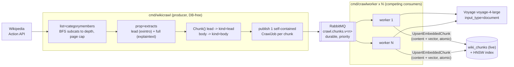

# Wikipedia Category-Crawl Ingestion — Design

Status: approved (brainstorm) — 2026-06-15
Author: verovec (with Claude)

## 1. Problem & motivation

The only way to populate the `wiki_chunks` evidence corpus today is the bulk dump
pipeline (`cmd/wikisync`), which downloads a multi-gigabyte Wikimedia dump
(`enwiki` is ~90 GB compressed) before it can stage and embed anything. That is
slow, heavy on disk, and a poor fit for "I just want a focused slice of Wikipedia
in the database, ready to go."

We want a second, **additive** ingestion path that:

- pulls a focused slice of Wikipedia **over HTTP** (no dump download),
- pushes **self-contained** work into RabbitMQ so the content sits in the broker
  ready to be consumed whenever a worker is brought up,
- is consumed by a worker that writes the chunks **directly into live
  `wiki_chunks`**, additive to whatever is already there,
- changes **nothing** in the existing dump/delta pipeline or the `embedworker`
  fleet.

## 2. Decisions (locked during brainstorming)

| Decision | Choice | Rationale |
|---|---|---|
| Crawl scope | **Category-driven** | Bounded and meaningful: traverse one or more Wikipedia categories (with a subcategory-depth and page-count cap) instead of an unbounded link crawl. |
| Corpus lifecycle | **Additive upsert into live `wiki_chunks`** | "Top up" the corpus; never wipe the dump-based data. Mirrors the delta path, not the destructive staging/swap. |
| Consumer | **New dedicated worker + its own queue** | Existing `embedworker`/`wikisync` stay untouched (the "don't break what works" constraint). |
| Data source | **MediaWiki Action API** | `list=categorymembers` + `prop=extracts` over HTTP. Clean text, page/revision ids, polite continuation + maxlag. Reuses `internal/wiki` machinery. No HTML scraping. |
| Content depth | **Lead + full body** | Richer evidence per article; first code to populate the reserved `kind='body'`. |

Approaches B (inline, no broker) and C (reuse `embedjob.Job` + `embedworker`,
requiring crawler DB access and the staging model) were considered and rejected
by these decisions.

## 3. Architecture



The producer never touches the database. The worker never touches the dump
pipeline's staging table. The two communicate only through self-contained broker
messages, so the broker can hold a primed corpus indefinitely before any worker
is started — the core convenience the feature exists for.

## 4. Components

| Piece | Location | Responsibility |
|---|---|---|
| Category crawler | `internal/wiki/crawl.go` (new) | `CategoryMembers` traversal via the Action API: BFS over subcategories to `MaxDepth`, dedupe page ids, stop at `MaxPages`, follow continuation, honor maxlag/Retry-After (reuse `APIClient.getJSON`). Returns the set of `(pageID, title)` to ingest. |
| Body extracts | `internal/wiki/mediawiki.go` (extend) | New `FullExtracts(ctx, titles)` using `explaintext` **without** `exintro` (full plain text + revision id), batched at the existing extracts limit. Existing `Extracts` (lead) is unchanged. |
| Crawl producer logic | `internal/wiki/crawlproduce.go` (new) | `RunCrawl`: drive the crawler, fetch lead + full text per page, build `CrawlJob`s (lead chunks then body chunks, contiguous `chunk_index`), publish each through the existing `Publisher` interface. Transport-free; no DB. |
| Crawl job + consumer | `internal/crawljob/crawljob.go` (new) | New transport-free package mirroring `internal/embedjob`: the `CrawlJob` message type + `validate`, and a `Worker` that embeds content then upserts it into live. Own small `Embedder` / `Store` / `Stream` / `Enqueuer` / `Delivery` interfaces and `Action`/`Result` types (independent of `embedjob`). |
| Producer binary | `cmd/wikicrawl/main.go` (new) | Wire config + `APIClient` + `queue.Client`; run `RunCrawl`; exit. No DB connection. |
| Consumer binary | `cmd/crawlworker/main.go` (new) | Wire config + `embed.Client` + `postgres.Store` + `queue.Client`; run the `crawljob.Worker` until SIGTERM. |
| Store write | `queries/wiki.sql` + `internal/store/postgres/wiki.go` (extend) | New `UpsertEmbeddedChunk` (`:batchexec`): `INSERT … ON CONFLICT (page_id, chunk_index) DO UPDATE` writing content **and** embedding in one statement, keeping the existing embedding only when content is byte-identical. Embedding written as text-form `::halfvec` (reuse the existing `formatHalfVec` helper — never binary COPY). Validates `EmbeddingDim == 1024` and `Kind.Valid()` like the existing writes. |
| Config | `internal/config/config.go` (extend) | New `LoadCrawl()` and `LoadCrawlQueue()` / `LoadCrawlWorker()` loaders (see §8). |
| Compose + make | `docker-compose.yml`, `Makefile` | `wikicrawl` (on-demand producer) + `crawlworker` (scalable) services behind the existing paid `wiki` profile; make targets in §9. |
| Docs | `docs/ingestion-pipeline.md` | Add a "Category-crawl ingestion" section in the **same change** (repo rule: changing the pipeline updates this file). |

## 5. Message shape

```go
// internal/crawljob
type CrawlJob struct {
    PageID     int64  `json:"page_id"`
    ChunkIndex int    `json:"chunk_index"`
    Title      string `json:"title"`
    URL        string `json:"url"`
    RevisionID int64  `json:"revision_id"`
    Corpus     string `json:"corpus"`
    Content    string `json:"content"`
    Section    string `json:"section"`            // "" for v1 (see §11)
    Kind       string `json:"kind"`              // "lead" | "body"
    Attempt    int    `json:"attempt,omitzero"`
}
```

`validate` rejects a job that can never succeed (and the worker ack-drops it):
`PageID > 0`, `ChunkIndex >= 0`, `Content != ""`, `Corpus != ""`,
`domain.WikiChunkKind(Kind).Valid()`, `RevisionID >= 0`, `Attempt >= 0`.

The message is fully self-contained: every field needed to write a live
`wiki_chunks` row travels in the body, so the worker performs zero DB reads
before writing and the broker can hold a complete corpus with no producer or DB
attached.

## 6. Data flow detail

**Crawl.** `CategoryMembers` issues `action=query&list=categorymembers&
cmtitle=Category:<name>&cmtype=page|subcat&cmprop=ids|title&cmlimit=500`,
following the `continue` token. Subcategories are enqueued for BFS up to
`MaxDepth` (0 = only the named category's direct pages). Page ids are deduped
across categories. Traversal stops once `MaxPages` distinct pages are collected.

**Extract.** For each batch of ≤20 titles: `Extracts` (existing, `exintro`)
yields the lead; `FullExtracts` (new, no `exintro`) yields the full plain text +
current revision id. Body text = full text with the lead prefix stripped
(`strings.TrimPrefix` of the intro; if the lead is not a clean prefix, fall back
to the full text as body and rely on chunk de-dup being harmless).

**Chunk + index.** `Chunk(title, lead)` produces lead chunks; `Chunk(title,
body)` produces body chunks. Chunk indices are a single contiguous space per
page: leads get `0..L-1`, bodies continue `L..L+B-1`. This keeps the
`(page_id, chunk_index)` PK stable and compatible with the existing
trim-by-index model.

**Publish.** One `CrawlJob` per chunk, JSON-marshaled, published via the broker
client with publisher confirms (at-least-once). Priority: `lead = MaxPriority`,
`body = MaxPriority/2` (reuse the kind heuristic). Publishing uses the same
windowed-confirm concurrency as `wiki.publishJobs`.

**Consume.** `crawljob.Worker.Process`: unmarshal → `validate` →
`EmbedDocuments([content])` (`input_type=document`) → check shape `1 × 1024` →
`UpsertEmbeddedChunk(chunk, embedding)`. Embedding-then-upsert in that order, with
the embedding written **in the same** upsert statement, means a row is never
visible to search without its matching vector (`SearchWikiChunks` filters
`WHERE embedding IS NOT NULL`).

## 7. Error handling & consistency

Worker semantics mirror `embedjob` exactly (proven, tested):

- malformed JSON / failed `validate` / unknown queue version → ERROR log +
  **ack-drop** (never loop on a poison message),
- unexpected provider response shape (≠ 1×1024) → ack-drop (provider contract
  break, re-embedding would reproduce it),
- transient embed/write failure → **republish** with `Attempt+1` at the same
  priority, drop after `CRAWL_WORKER_MAX_ATTEMPTS` with an ERROR log,
- shutdown mid-work (ctx canceled) → **Nack requeue** (no attempt burned),
- the embed client keeps its existing 429/timeout retry + optional RPM pacing.

Producer:

- Action-API throttling is already retried in `getJSON` (Retry-After, maxlag,
  capped backoff). A missing category or hard API error exits non-zero.
- Publish uses confirms; a failed confirm fails the run (re-run resumes).
- **Resumability:** the producer keeps no checkpoint. A crash → re-run from the
  start; idempotent upserts make re-publishing harmless (re-embedding the same
  content rewrites the same vector). Checkpointing is an explicit non-goal for
  v1 (§11).

Vector consistency guarantees are unchanged from the dump pipeline: one model
(`voyage-4-large`), one dimension (1024), one type (`halfvec(1024)`), text-form
`::halfvec` writes only, `input_type=document` on ingest. `wikiverify` continues
to assert the whole live corpus, crawl rows included.

**Provenance & PK.** Crawl rows carry `corpus = CRAWL_CORPUS` (default
`<project>-crawl`), distinct from the dump corpus, so a dump-corpus delta run
(keyed on its own checkpoint) never refetches or deletes crawl rows, and vice
versa. The `(page_id, chunk_index)` PK is **global**, so a page present in both
the dump and the crawl collapses to one row (last writer wins on content +
provenance tag) — correct dedup, documented behavior.

## 8. Configuration

| Env var | Default | Controls |
|---|---|---|
| `CRAWL_CATEGORIES` | (required for producer) | Comma-separated category titles, e.g. `Category:Climate change,Category:Physics`. |
| `CRAWL_PROJECT` | `WIKI_CORPUS` value | Wiki project to hit and to build article URLs (e.g. `simplewiki`). Drives the API endpoint and URL host. |
| `CRAWL_CORPUS` | `<project>-crawl` | Provenance tag stored in `wiki_chunks.corpus`. |
| `CRAWL_MAX_DEPTH` | `1` | Subcategory recursion depth (0 = direct pages only). |
| `CRAWL_MAX_PAGES` | `5000` | Hard cap on distinct pages collected. |
| `CRAWL_INCLUDE_BODY` | `true` | When false, ingest lead only (`kind='lead'`). |
| `RABBITMQ_CRAWL_QUEUE` | `crawl.chunks` | Base queue name; versioned via the existing `RABBITMQ_QUEUE_VERSIONS` machinery. |
| `CRAWL_WORKER_CONCURRENCY` | `4` | In-flight embeds per worker replica; also the prefetch. |
| `CRAWL_WORKER_MAX_ATTEMPTS` | `5` | Delivery budget before a job is dropped. |
| `CRAWLWORKER_REPLICAS` | `2` | Competing worker replicas (Compose scale). |

Embedding key/model reuse the existing `EMBEDDING_API_KEY` / `EMBEDDING_MODEL`.
The broker URL reuses `RABBITMQ_URL`.

## 9. Operations

Behind the paid `wiki` Compose profile (so a plain `make up` never starts it):

```bash
make fleet-up                              # broker (reused from the dump pipeline)
make crawl-workers CRAWLWORKER_REPLICAS=4  # start N crawl consumers
make crawl CRAWL_CATEGORIES="Category:Climate change" CRAWL_MAX_PAGES=2000
                                           # run the producer: crawl + publish, then exit
make wiki-verify                           # corpus (dump + crawl) complete & consistent
make fleet-down
```

| Target | Purpose |
|---|---|
| `make crawl` | Run the `wikicrawl` producer once against `CRAWL_CATEGORIES`. |
| `make crawl-workers [CRAWLWORKER_REPLICAS=N]` | Start N `crawlworker` consumers. |

## 10. Testing

No new third-party dependency (reuse `amqp091-go`, `net/http`, `internal/embed`),
so nothing new to version-verify. Every behavior ships with tests:

- `internal/wiki/crawl_test.go` — table-driven `httptest` server: subcat BFS,
  depth cap, page cap, dedupe, continuation, maxlag retry. (Mirrors
  `mediawiki_test.go`.)
- `internal/wiki/mediawiki_test.go` — `FullExtracts` body text + revision,
  intro-prefix stripping.
- `internal/wiki/crawlproduce_test.go` — page → `CrawlJob`s: contiguous
  lead-then-body indices, kinds, priorities, captured bodies via a fake
  `Publisher`.
- `internal/crawljob/crawljob_test.go` — `validate` cases; `Process` happy path,
  malformed, invalid, dim mismatch, transient retry, exhausted attempts,
  shutdown requeue, unknown version (fakes for embedder/store/stream).
- `internal/store/postgres/wiki_test.go` — `UpsertEmbeddedChunk` integration:
  content+vector round-trip, idempotent re-apply, content-change invalidation,
  wrong-dim rejection. (Integration tests need a throwaway DB — they drop tables;
  do not point them at the seeded dev DB.)
- `internal/config/config_test.go` — new loaders, including `CRAWL_CATEGORIES`
  required, defaults, and `CRAWL_PROJECT` validation.

E2E: `make fleet-up` + `make crawl-workers` + `make crawl` against a tiny
category, confirm rows land in live `wiki_chunks` with non-null embeddings and
`make wiki-verify` stays green.

## 11. Non-goals / known limitations (v1)

- **Section headings.** `prop=extracts` strips heading markup, so body chunks
  store `section=''`. Capturing real section names needs `action=parse`; deferred.
- **Producer checkpointing.** No resume cursor; a crash means re-run (safe via
  idempotent upserts). Add a checkpoint only if large crawls prove it necessary.
- **Re-embedding cost on re-crawl.** The worker always embeds before upsert, so
  re-crawling a category re-embeds unchanged articles. A "skip if stored revision
  matches" guard (one DB read before embed) is a documented follow-up, not v1.
- **Cloud/Terraform wiring.** This design covers local + the shared broker. A
  Fargate `wikicrawl` task / `crawlworker` service mirrors the existing producer
  and worker-lifecycle infra and is out of scope here.

## 12. Cross-references

- Existing pipeline: `docs/ingestion-pipeline.md`
- Queue transport: `internal/queue/queue.go`
- Worker pattern to mirror: `internal/embedjob/embedjob.go`
- Delta upsert + store methods: `internal/wiki/delta.go`,
  `internal/store/postgres/wiki.go`, `queries/wiki.sql`
- Chunking: `internal/wiki/chunk.go`
- API client: `internal/wiki/mediawiki.go`
- Data dictionary: `.claude/skills/data-map/SKILL.md`
</content>
</invoke>
