# Fact-Checkable Crawl Ingestion — Design

Status: approved (brainstorm) — 2026-06-16
Author: verovec (with Claude)

## 1. Problem & motivation

The ingestion pipeline today populates the `wiki_chunks` evidence corpus from a
multi-gigabyte Wikimedia **dump** (`cmd/wikisync` → RabbitMQ → `cmd/embedworker`
fleet → live `wiki_chunks`). It already has the broker-and-scalable-fleet shape
the project wants — competing-consumer workers embed and write rows for as long
as they are up — and a full AWS mirror (Fargate producer, worker-lifecycle
lambda, Amazon MQ). What it does **not** have:

- a way to ingest **without downloading the dump** (the `2026-06-15`
  category-crawl design solves this but is not yet implemented),
- a **fact-checkability filter**: today every lead paragraph is embedded, so the
  corpus carries prose that is useless as fact-check evidence. We want to embed
  **only verifiable, citable factual content**, not all of Wikipedia,
- a producer that **primes the broker when the stack comes up** under the paid
  profile, so workers can be scaled against an already-filled queue,
- the **same crawl workflow on AWS** as exists for the dump pipeline.

Confidence-by-closeness — "how close are we to the matched chunks and claims" —
already exists (`internal/service/confidence.go`) and is correct; the gap there
is exposure and documentation, not logic.

This design delivers a second, **additive** ingestion path (the crawl pipeline)
with a producer-side fact-checkability gate, an auto-prime compose service, the
AWS mirror, and the confidence surfacing. The existing dump pipeline and
`embedworker` fleet are **unchanged**.

## 2. Decisions (locked during brainstorming)

| Decision | Choice | Rationale |
|---|---|---|
| Ingestion source | **MediaWiki Action API, category-driven** | No dump download; a bounded, meaningful slice. Per the `2026-06-15` design. |
| Fact-checkability filter | **LLM gate, per chunk** | "Precheck every statement." A binary "is this citable factual evidence?" judgment, temperature-0 forced-tool Haiku call. |
| Filter placement | **In the producer, before publishing** | The broker and all downstream embedding cost are bounded to fact-checkable content; producer stays DB-free. Decision is baked in at crawl time. |
| Auto-start | **Auto-prime only under the paid `wiki` profile** | `--profile wiki up` fills the broker; a plain `make up` still spends nothing. Preserves the cost-safety rule. |
| Adapter strategy | **Consolidate into `internal/llm` first** | This gate is the third near-identical Anthropic adapter (after `stance`, `checkworthy`); the deferred-consolidation trigger has fired. |
| Confidence scoring | **Keep the formula, surface + document it** | `service/confidence.go` already scores closeness over matched chunks and claims. |
| Delivery | **Epic with serial child cards** | Matches the project's `depends_on` chain style. |

## 3. Architecture

```mermaid
flowchart LR
    CAT["Wikipedia<br/>Action API"]
    subgraph PROD["cmd/wikicrawl (producer, DB-free, + LLM)"]
      M["list=categorymembers<br/>BFS subcats to depth, page cap"]
      X["prop=extracts<br/>lead (exintro) + full (explaintext)"]
      C["Chunk() lead -> kind=lead<br/>body -> kind=body"]
      G["[NEW] fact-checkability gate<br/>internal/llm: is this citable<br/>factual evidence?"]
      P["publish 1 CrawlJob per<br/>PASSING chunk (priority)"]
    end
    Q[["RabbitMQ<br/>crawl.chunks.v&lt;n&gt;<br/>durable, priority, versioned"]]
    subgraph FLEET["cmd/crawlworker x N (competing consumers)"]
      W1["worker 1"]
      WN["worker N"]
    end
    V["Voyage voyage-4-large<br/>input_type=document"]
    LIVE[("wiki_chunks (live)<br/>+ HNSW index")]
    SRCH["search -> computeConfidence<br/>closeness to chunks AND claims"]

    CAT --> M --> X --> C --> G --> P --> Q
    Q --> W1 & WN
    W1 & WN --> V
    W1 & WN -->|"UpsertEmbeddedChunk"| LIVE
    LIVE --> SRCH
```



The producer never touches the database. The gate runs in the producer, so only
fact-checkable chunks ever reach the broker — the broker can hold a complete,
pre-filtered corpus indefinitely before any worker starts, and no embedding
spend is wasted on non-evidence. The worker never touches the dump pipeline's
staging table. The two communicate only through self-contained broker messages.

## 4. Components & scope (the epic)

Serial `depends_on` chain. Each card ships its tests and updates
`docs/ingestion-pipeline.md` in the same change.

### Card 1 — Consolidate Anthropic adapters into `internal/llm`
Pure refactor, no behavior change. `internal/stance` and `internal/checkworthy`
are near-identical forced-tool Anthropic clients; collapse the shared transport
(client construction, model default, forced-tool call, structured-input decode,
error wrapping) into one `internal/llm` package. `stance` and `checkworthy`
become thin callers that supply their prompt + tool schema + result type.
Service interfaces (`StanceClassifier`, `CheckWorthinessClassifier`) are
unchanged, so handlers and the live path are untouched. Tests: existing
`stance` / `checkworthy` tests stay green; new `internal/llm` table-driven test
for the shared call (happy path, transport error, missing tool block, malformed
input). Verify the Anthropic SDK version against Context7 before touching it.

### Card 2 — Category-crawl ingestion pipeline
Implement the `2026-06-15-wikipedia-category-crawl-ingestion-design.md`
verbatim: `internal/wiki/crawl.go` (category BFS), `FullExtracts` for body,
`internal/wiki/crawlproduce.go` (`RunCrawl`), `internal/crawljob` (`CrawlJob` +
`Worker`), `cmd/wikicrawl`, `cmd/crawlworker`, `UpsertEmbeddedChunk` in
`queries/wiki.sql` + `internal/store/postgres/wiki.go`, config loaders, compose
services + make targets, all behind the paid `wiki` profile. The gate (Card 3)
is **not** wired here — Card 2 publishes every chunk; the gate is an additive
step. Tests as enumerated in §10 of that design.

### Card 3 — Fact-checkability gate in the crawl producer
Depends on Cards 1 + 2. A new chunk-level classifier built on `internal/llm`:
the prompt judges *"does this passage contain verifiable, citable factual
content suitable as fact-check evidence?"* — distinct from `checkworthy`, which
judges a single short **spoken statement**. The producer runs the gate on each
chunk after `Chunk()` and before `publish`; a chunk that fails is dropped (not
published) and counted. Knobs: `CRAWL_CHECKWORTHY` (default `true`; `false` =
publish everything, the pre-gate behavior), `CRAWL_CHECKWORTHY_CONCURRENCY`,
`CRAWL_CHECKWORTHY_RPM`. The producer now needs `ANTHROPIC_API_KEY`
(`CHECKWORTHY_API_KEY` per the existing config naming). Tests: fake-LLM gate
test mirroring `checkworthy_test.go` (pass, fail, error→degrade); a
`crawlproduce` test asserting failed chunks are not published and the pass count
is logged.

### Card 4 — Compose auto-prime under the `wiki` profile
Depends on Card 2. A compose service in the `wiki` profile runs `wikicrawl`
once on `--profile wiki up`, filling the broker from `CRAWL_CATEGORIES`. A plain
`make up` starts nothing paid. Idempotent upserts make a re-prime on restart
harmless; the service is `restart: "no"` so it runs to completion and exits.
Document the env (`CRAWL_CATEGORIES`, caps) it reads. Tests: the auto-prime is
operational wiring (compose + docs); the producer logic is covered by Cards 2/3.
The card's verification is the e2e run in §6.

### Card 5 — Surface + document confidence-by-closeness
Independent (can run in parallel). `computeConfidence` already scores closeness
over matched chunks **and** claims; this card exposes the score plus the
supporting/contradicting evidence breakdown in the API response and the UI, and
documents the formula (the `data-map` skill + the ingestion/scoring docs). No
formula change. Tests: handler/serialization test for the exposed fields;
frontend Vitest for the rendered score.

### Card 6 — Cloud/AWS wiring for the crawl pipeline
Depends on Cards 2–4. Mirror the dump pipeline's AWS setup for crawl:
- a Fargate `wikicrawl` task definition (on-demand `run-task`, off by default
  via an `enable_crawl_producer` Terraform var), reading the Anthropic key from
  Secrets Manager in addition to the embedding key,
- a `crawlworker` service under the existing worker-lifecycle EXTERNAL
  deployment controller (scale/deploy via the lambda, never a direct service
  update),
- the versioned crawl queue on Amazon MQ (reuse the `RABBITMQ_QUEUE_VERSIONS`
  machinery),
- extend `scripts/deploy-ingestion.sh` to ship the image to both crawl
  workloads (skipped, not fatal, when unprovisioned),
- the SSM-bastion drain-locally model works unchanged (point `crawlworker` at
  the tunnel + local Postgres). Tests: `scripts/deploy-ingestion.test.sh`
  extended with the crawl workloads (stubbed `aws`); `terraform validate` in CI.

## 5. Message shape & data model

`CrawlJob` and `UpsertEmbeddedChunk` are exactly as in the `2026-06-15` design
(§5–§6 there). The gate changes **which** chunks become `CrawlJob`s, not the job
shape. `wiki_chunks` schema is unchanged: crawl rows carry `corpus =
CRAWL_CORPUS` (default `<project>-crawl`), `kind IN ('lead','body')`, the global
`(page_id, chunk_index)` PK, embedding written as text-form `::halfvec`. No
migration is required by this design.

## 6. Operations (target procedure)

Behind the paid `wiki` Compose profile (a plain `make up` starts nothing paid):

```bash
# 1. Configure the slice + the gate (in .env)
#    CRAWL_CATEGORIES="Category:Climate change,Category:Vaccines"
#    CRAWL_MAX_PAGES=2000   CRAWL_CHECKWORTHY=true

# 2. Bring up the paid profile: broker + auto-prime producer + workers.
#    The producer crawls, gates, and fills the broker; workers drain it.
docker compose --profile wiki up -d            # or: make fleet-up && make crawl-workers

# 3. Or run the producer explicitly (re-prime / different categories):
make crawl CRAWL_CATEGORIES="Category:Physics" CRAWL_MAX_PAGES=1000

# 4. Scale the consumer fleet to taste (more workers = faster drain, same $):
make crawl-workers CRAWLWORKER_REPLICAS=6

# 5. Verify and stop:
make wiki-verify       # dump + crawl rows complete & consistent
make fleet-down
```

The cloud procedure mirrors the dump pipeline (§10 of `docs/ingestion-pipeline.md`):
deploy the image to the `wikicrawl` task + `crawlworker` service, launch the
producer with `aws ecs run-task`, drain into the cloud `wiki_chunks` (or locally
via the SSM bastion tunnel).

## 7. Error handling & consistency

- **Gate failure degrades safe.** A transport error or malformed reply from the
  gate is logged and the chunk is **published anyway** (fail-open), so a flaky
  LLM never silently empties the corpus. `CRAWL_CHECKWORTHY=false` disables the
  gate entirely. (Symmetry note: the live `checkworthy` cascade degrades to its
  heuristic; the ingest gate has no heuristic, so it fails open.)
- **Worker semantics** mirror `embedjob` exactly (malformed/invalid → ack-drop;
  transient → republish `Attempt+1`; exhausted → drop with ERROR; shutdown →
  Nack requeue). Vector-consistency guarantees are unchanged (one model, one
  dim, one type, text-form `::halfvec`, `input_type=document`, NULL rows
  invisible to search).
- **Resumability.** The producer keeps no checkpoint; a crash → re-run, made
  harmless by idempotent upserts (re-embedding the same content rewrites the
  same vector). The gate re-judges on re-run — accepted for v1.

## 8. Configuration (new)

| Env var | Default | Controls |
|---|---|---|
| `CRAWL_CHECKWORTHY` | `true` | Enable the producer-side fact-checkability gate. `false` publishes every chunk. |
| `CRAWL_CHECKWORTHY_MODEL` | `claude-haiku-4-5-20251001` | Gate model (cheapest fast Claude). |
| `CRAWL_CHECKWORTHY_CONCURRENCY` | `8` | In-flight gate judgments in the producer. |
| `CRAWL_CHECKWORTHY_RPM` | `0` (unpaced) | Per-producer Anthropic rate cap. |
| `CHECKWORTHY_API_KEY` | — | Anthropic key for the gate (reuse the existing checkworthy key name). |

All `CRAWL_*` crawl knobs (`CRAWL_CATEGORIES`, `CRAWL_PROJECT`, `CRAWL_CORPUS`,
`CRAWL_MAX_DEPTH`, `CRAWL_MAX_PAGES`, `CRAWL_INCLUDE_BODY`, the worker/queue
vars) are as defined in the `2026-06-15` design §8.

## 9. Honest caveats / non-goals (v1)

- **Gate cost.** A per-chunk LLM call on a large crawl (e.g. 5000 pages,
  lead+body) is tens of thousands of Haiku calls. Cheap per call, but real; the
  `CRAWL_CHECKWORTHY_RPM` cap and `CRAWL_MAX_PAGES` bound it, and `dry-run`-style
  counting is a documented follow-up.
- **Gate decision is baked at crawl time.** Re-tuning the gate prompt/threshold
  requires a re-crawl (the producer-placement trade-off chosen deliberately over
  worker-side filtering). Dropped chunks are counted/logged but not stored.
- **No section headings** (`prop=extracts` strips them → `section=''`), **no
  producer checkpoint**, **re-crawl re-embeds unchanged articles** — all carried
  over from the `2026-06-15` design's non-goals.
- **Confidence formula is unchanged** — Card 5 surfaces and documents it, it does
  not recalibrate it.

## 10. Cross-references

- Prior crawl design: `docs/superpowers/specs/2026-06-15-wikipedia-category-crawl-ingestion-design.md`
- Pipeline doc (to be rewritten to the target): `docs/ingestion-pipeline.md`
- Adapters to consolidate: `internal/stance`, `internal/checkworthy`
- Confidence: `internal/service/confidence.go`
- Worker pattern to mirror: `internal/embedjob/embedjob.go`
- Cloud deploy: `scripts/deploy-ingestion.sh`, `scripts/ssm-port-forward.sh`,
  `internal/workerlifecycle`, `stack/terraform`
- Data dictionary: `.claude/skills/data-map/SKILL.md`
